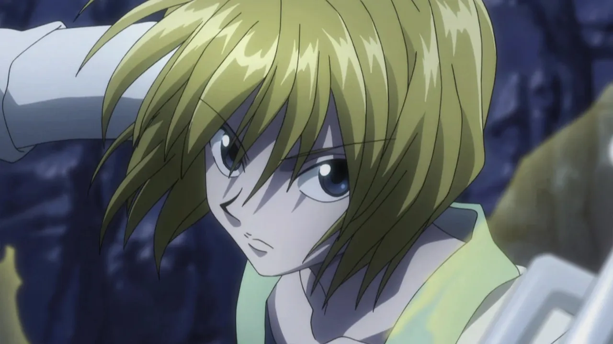

# Anime Series: Hunter x Hunter

## Introduction

Hunter x Hunter" is a popular Japanese manga series written and illustrated by Yoshihiro Togashi. The manga was first serialized in Weekly Shonen Jump magazine in 1998 and has since been collected into numerous volumes. The series has also been adapted into multiple anime series, OVAs (Original Video Animations), and movies.

The story follows a young boy named Gon Freecss, who discovers that his absentee father, Ging Freecss, is a legendary "Hunter," a member of an elite group with special privileges including access to restricted areas and information. Determined to find his father, Gon decides to become a Hunter himself. Along the way, he meets various friends and foes, each with their own goals and motivations.

The "Hunter x Hunter" anime has been adapted multiple times. The first anime adaptation aired from 1999 to 2001 and covered a significant portion of the manga. However, due to catching up with the manga's ongoing story, the anime concluded without a complete adaptation.

In 2011, a new anime adaptation began airing, produced by Madhouse studio. This adaptation faithfully followed the manga and covered more material than the original series. It received critical acclaim for its animation quality, character development, and storytelling. However, the anime adaptation also faced challenges due to the irregular release schedule of the manga. As a result, the anime went on hiatus several times and concluded in 2014 without covering the entire manga storyline.

"Hunter x Hunter" has garnered a large and dedicated fanbase worldwide, known for its intricate world-building, complex characters, and strategic battles. Despite its sporadic release schedule, both the manga and anime remain highly regarded within the anime and manga community.

## Main Protagonist

## Gon Freecss

The protagonist of the series, Gon is a young boy who embarks on a journey to become a Hunter like his father, Ging Freecss, in order to find him. He's cheerful, determined, and possesses great potential as a Hunter.

##  Killua Zoldyck

Killua is the third child of the infamous Zoldyck family of assassins. He becomes Gon's best friend and companion throughout their adventures. Despite his assassin upbringing, Killua is kind-hearted, witty, and incredibly skilled in combat.

## Kurapika

Kurapika is the last surviving member of the Kurta Clan, seeking revenge against the Phantom Troupe for massacring his people and stealing their scarlet eyes. He is a skilled and intelligent fighter who becomes a close ally of Gon and Killua.

## Leorio Paradinight

Leorio is a medical student who aspires to become a doctor. He joins Gon, Killua, and Kurapika on their journey to become Hunters. While not as adept in combat as his companions, Leorio is passionate, loyal, and often provides comic relief.

## Main Antagonist

## Hisoka Morow

Hisoka is a recurring antagonist in the series, although his motivations and allegiances are complex. He is a highly skilled and dangerous hunter who enjoys battling strong opponents. Hisoka's main goal is to fight and defeat powerful individuals, particularly those who show great potential. His ambiguous nature and unpredictable actions make him a fascinating character throughout the series.

## Genei Ryodan (Phantom Troupe)

This is a group of thieves composed of extremely powerful individuals, each with their own unique abilities. Led by Chrollo Lucilfer, the Phantom Troupe's main goal is to acquire wealth and power through theft and criminal activities. They're known for their ruthlessness and formidable combat skills, posing a significant threat to anyone who crosses their path.

## Genthru and the Bombers

Genthru is the leader of a group of Nen users known as the Bombers. They participate in the Greed Island arc, where they aim to collect all of the game's cards by any means necessary, including violence and manipulation. Genthru, in particular, is cunning and ruthless, posing a significant challenge to Gon and his friends.

## Chimera Ants

Initially introduced as a species of insect-like creatures, the Chimera Ants become a major threat when their queen starts consuming humans to give birth to more powerful offspring. The Chimera Ant arc features various Chimera Ants who evolve both physically and mentally, becoming increasingly dangerous adversaries for the protagonists.

## Nen Types

In "Hunter x Hunter," Nen is a powerful energy system that characters use to perform various supernatural abilities. There are six main categories, or Nen types, each with its own strengths, weaknesses, and characteristics. Here are the six Nen types:

1. Enhancement: Enhancement focuses on increasing the user's physical abilities and overall effectiveness in combat. Users of this type often have enhanced strength, durability, and speed. They can also reinforce objects or other people with their aura.
2. Emission: Emission allows users to project their aura away from their body, typically in the form of ranged attacks or abilities. Users of this type excel at long-range combat and can create powerful projectiles or energy blasts.
3. Manipulation: Manipulation enables users to control and manipulate objects or creatures with their aura. Users of this type can exert their will over targets, making them move, behave, or act according to their commands.
4. Transmutation: Transmutation allows users to change the properties of their aura, giving it characteristics similar to other substances or materials. Users of this type can transform their aura into various forms, such as fire, electricity, or other elements.
5. Conjuration: Conjuration enables users to create physical objects or entities out of their aura. These created objects can range from simple tools to complex weapons or creatures. Conjurers typically have a strong connection to the objects they create.
6. Specialization: Specialization is the rarest and most unique Nen type, as it encompasses abilities that don't fit neatly into the other categories. Users of this type have highly individualized abilities that often defy categorization. Specialization abilities can vary greatly from one user to another.

|Title Of The Episode|
 |--------------|
 |Hunter Exam Arc|
 |Heavens Arena Arc|
 |Phantom Troupe Arc|
 |Greed Island Arc|
 |Chimera Ant Arc|
 |Election Arc|
