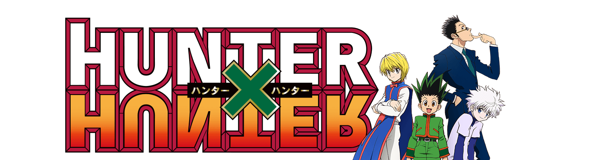

# Anime Series: Hunter x Hunter

## Introduction
Hunter x Hunter is a popular Japanese manga series written and illustrated by Yoshihiro Togashi. It has been serialized in Weekly Shonen Jump magazine since March 1998. The story follows a young boy named Gon Freecss who discovers that his father, whom he believed to be dead, is actually a legendary Hunter, a special individual who has proven themselves through rigorous examination to be an elite member of humanity.

## Main Protagonist

## Gon Freecss

The protagonist of the series, Gon is a young boy who embarks on a journey to become a Hunter like his father, Ging Freecss, in order to find him. He's cheerful, determined, and possesses great potential as a Hunter.

##  Killua Zoldyck

Killua is the third child of the infamous Zoldyck family of assassins. He becomes Gon's best friend and companion throughout their adventures. Despite his assassin upbringing, Killua is kind-hearted, witty, and incredibly skilled in combat.

## Kurapika

Kurapika is the last surviving member of the Kurta Clan, seeking revenge against the Phantom Troupe for massacring his people and stealing their scarlet eyes. He is a skilled and intelligent fighter who becomes a close ally of Gon and Killua.

## Leorio Paradinight

Leorio is a medical student who aspires to become a doctor. He joins Gon, Killua, and Kurapika on their journey to become Hunters. While not as adept in combat as his companions, Leorio is passionate, loyal, and often provides comic relief.

## Main Antagonist

## Hisoka Morow

Hisoka is a recurring antagonist in the series, although his motivations and allegiances are complex. He is a highly skilled and dangerous hunter who enjoys battling strong opponents. Hisoka's main goal is to fight and defeat powerful individuals, particularly those who show great potential. His ambiguous nature and unpredictable actions make him a fascinating character throughout the series.

## Genei Ryodan (Phantom Troupe)

This is a group of thieves composed of extremely powerful individuals, each with their own unique abilities. Led by Chrollo Lucilfer, the Phantom Troupe's main goal is to acquire wealth and power through theft and criminal activities. They're known for their ruthlessness and formidable combat skills, posing a significant threat to anyone who crosses their path.

## Genthru and the Bombers

Genthru is the leader of a group of Nen users known as the Bombers. They participate in the Greed Island arc, where they aim to collect all of the game's cards by any means necessary, including violence and manipulation. Genthru, in particular, is cunning and ruthless, posing a significant challenge to Gon and his friends.

## Chimera Ants

